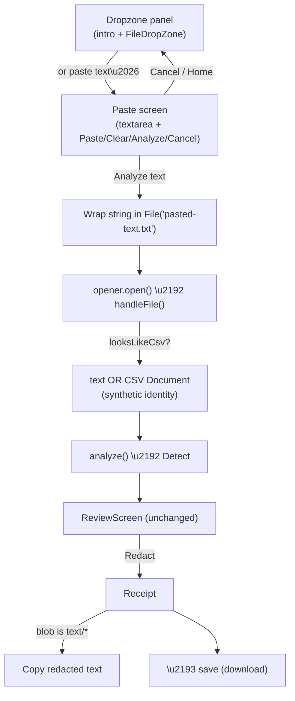

# Plain-text paste support

Status: ready-for-agent

## Parent

`.scratch/v1/PRD.md` (Redactyl v1)

## Problem

Redactyl only accepts data by opening a **file** (`.pdf` / `.txt` / `.md` / `.csv`). Users frequently have the text they want to sanitise on the clipboard — an email body, a chat log, a snippet from a spreadsheet — and today must first save it to a file before Redactyl can touch it. There is no way to paste text directly, and no way to take the redacted result away as text (only as a downloaded file).

## Goal

Let users **Paste** text into Redactyl, run the full detect → review → redact flow on it, and **Copy** the redacted result back to the clipboard — without ever creating a file. "Paste in, copy out."

## Design summary

Pasted text is modelled as an ordinary text/CSV **Document** with a synthetic identity, not as a new concept. The pasted string is wrapped in an in-memory `File` named `pasted-text.txt` and run through the existing `createDocumentOpener`, so the extension/`looksLikeCsv` sniff, the Document seam, review, redaction, the Mapping sidecar and the receipt are all reused verbatim. See [ADR 0007](../../../docs/adr/0007-pasted-text-as-synthetic-file-document.md).

## Resolved decisions

| Question | Decision |
| --- | --- |
| Domain model for pasted text | A text/CSV **Document** with a **synthetic identity** (`pasted-text` → `pasted-text.redacted.txt`). `CONTEXT.md` **Document** widened and a **Paste** term added. |
| Implementation shape | Wrap the pasted string in `new File([text], 'pasted-text.txt', { type: 'text/plain' })` and reuse `opener.open()` → `handleFile()`. No duplicated dispatch. See ADR 0007. |
| Entry point | A sibling affordance in the dropzone panel ("or paste text…") that navigates to a new full **screen** (not a modal). |
| Modal vs screen | New screen, for consistency with the full-screen stages, room for long text, and free Home/back. |
| CSV sniffing | Pasted text is sniffed exactly like a `.txt` file — tabular content opens as a **CSV** Document (cell-safe redaction, name-column refinement); plain content opens as text. |
| Paste button | Convenience `navigator.clipboard.readText()` on the input screen; native ⌘/Ctrl+V still works. |
| Clipboard-read blocked | Graceful fallback: focus the textarea and show a "press ⌘/Ctrl+V" hint. No hard error. |
| Copy button | On the **output/receipt**, not the input. Copies the redacted text to the clipboard. |
| Copy scope | Any **text-based** output (gate on `blob.type` starting with `text/` → `text/plain` + `text/csv`); PDF (`application/pdf`) is never copyable. No source-provenance flag threaded. |
| Download | Still offered on the receipt alongside Copy. |
| Input affordances | Full-height textarea (type or paste), "Paste from clipboard", "Clear", primary "Analyze text" CTA (disabled when empty/whitespace-only), "Cancel" link home. |
| Size cap | None in v1 — existing chunking handles large text. |

## Delivery slices

### Slice 1 — Paste screen + entry point + flow

- Add `{ name: 'paste' }` to the `Screen` union in `src/App.tsx`.
- Add an affordance in the `dropzone` panel ("or paste text…") that does `setScreen({ name: 'paste' })`.
- New component `src/ui/PasteScreen.tsx`: full-height textarea, "Paste from clipboard", "Clear", "Analyze text" (disabled while empty/whitespace), "Cancel".
- On submit, build `new File([text], 'pasted-text.txt', { type: 'text/plain' })` and call the existing `handleFile(file)`; on cancel, return to `dropzone`.
- Styles for `.paste-screen` and the dropzone paste affordance in `src/styles.css`.

Acceptance criteria:

- [ ] The home/dropzone panel shows a paste affordance next to file upload
- [ ] Clicking it opens a dedicated paste screen with a focusable textarea
- [ ] "Analyze text" is disabled until the textarea has non-whitespace content
- [ ] Submitting plain text runs analyzing → review → redacting → receipt (same as a file)
- [ ] "Clear" empties the textarea; "Cancel" and TopBar Home return to the dropzone
- [ ] "Paste from clipboard" inserts clipboard text; when the read is blocked it focuses the textarea and shows a "press ⌘/Ctrl+V" hint instead of erroring

### Slice 2 — Sniff parity for pasted tabular text

- Confirmed by reuse: because the paste is opened through `createDocumentOpener` as `pasted-text.txt`, the existing `.txt` + `looksLikeCsv` branch already routes tabular pastes to `createCsvDocument`.

Acceptance criteria:

- [ ] Pasting comma-separated tabular text opens a CSV Document (row/column locators, cell-safe redaction, name-column refinement)
- [ ] Pasting prose opens a text Document (line locators)
- [ ] The redacted paste saves as `pasted-text.redacted.txt` in both cases

### Slice 3 — Copy redacted text on the receipt

- Add a "Copy redacted text" button to `src/ui/Receipt.tsx`, shown when `blob.type.startsWith('text/')`.
- Handler: `await blob.text()` → `navigator.clipboard.writeText(...)`, with a transient "Copied" state and a graceful failure message. Download button unchanged.

Acceptance criteria:

- [ ] The receipt shows "Copy redacted text" for text and CSV outputs, and hides it for PDF output
- [ ] Clicking it writes the redacted text to the clipboard and shows a brief "Copied" confirmation
- [ ] A blocked clipboard write shows a non-fatal message; the download still works

## Files

- `CONTEXT.md` — Document definition widened; **Paste** term added (done)
- `docs/adr/0007-pasted-text-as-synthetic-file-document.md` — decision record (done)
- `src/App.tsx` — `paste` screen variant, entry affordance, submit → synthetic File → `handleFile`
- `src/ui/PasteScreen.tsx` — new input screen
- `src/ui/Receipt.tsx` — "Copy redacted text" for text-based output
- `src/styles.css` — paste screen + affordance styling
- Tests: `src/ui/PasteScreen.test.ts(x)`, `src/ui/Receipt.test.ts`, and an opener/sniff test building a `File` from a CSV-looking string

## Testing

- [ ] `PasteScreen`: CTA disabled when empty, enabled with text; Clear empties; clipboard-read failure shows the ⌘/Ctrl+V hint
- [ ] `Receipt`: Copy shown for `text/plain` and `text/csv` blobs, hidden for `application/pdf`; copy writes the redacted text (mocked clipboard)
- [ ] Sniff: a `File` built from CSV-looking text opens as a CSV Document via the opener
- [ ] `pnpm build`, `pnpm lint`, `pnpm test` green

## Blocked by

- `.scratch/v1/issues/22-csv-txt-content-sniff.md` (sniff path reused for pasted tabular text) — completed

## References

- ADR: `docs/adr/0007-pasted-text-as-synthetic-file-document.md`
- ADR: `docs/adr/0004-csv-cell-flattening-for-detect.md` (CSV sniff reused)
- `src/document/opener.ts` (`createDocumentOpener`, `looksLikeCsv` branch)
- `src/App.tsx` (`handleFile`, `analyze`, `Screen` union, dropzone panel)
- `src/ui/Receipt.tsx`, `src/ui/FileDropZone.tsx`
- `CONTEXT.md` (**Document**, **Paste**)

## Comments

### Spec drafted (2026-07-01)

Design finalised in a grilling session. Glossary updated inline (`CONTEXT.md`): **Document** widened to cover pasted text; **Paste** term added. ADR 0007 records the synthetic-`File`/reuse-the-opener decision. Not yet implemented — slices above are ready for an agent.
