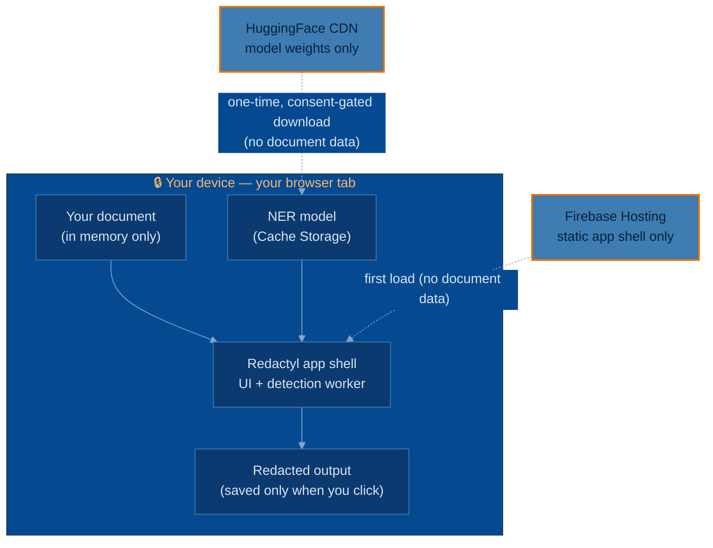
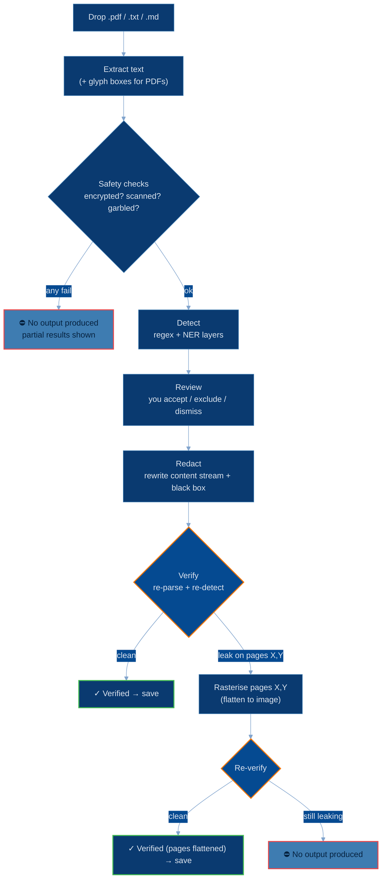
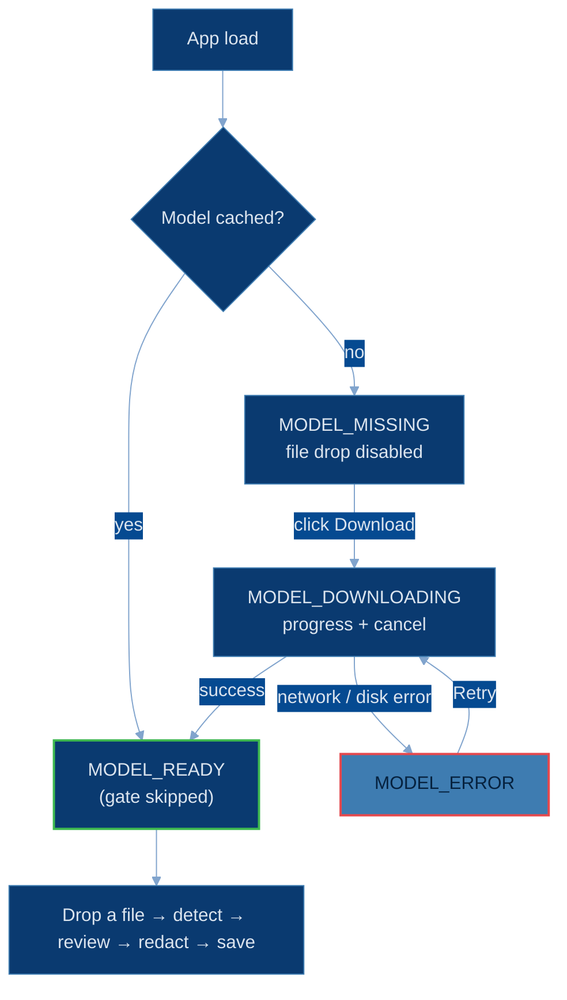

# Redactyl

**Strip PII from PDFs and text, entirely in your browser.**

Redactyl finds personal data in PDFs and text files and produces a sanitised
copy where the data is *truly removed* — not just visually covered. It runs
**100% in your browser**: there is no backend, your documents are never uploaded,
and after the one-time model download the app makes **zero network requests**
while it works. The whole thing is open source so you can verify that claim
rather than take it on faith.

> The central guarantee is **fail-closed**: if Redactyl can't be certain it
> sanitised a document (encrypted, scanned, garbled, or a redaction it can't
> verify even after rasterising), it produces **no output file at all** — so you
> can never be handed a document that looks redacted but isn't.

Live at **[redactyl.jamesgarner.me](https://redactyl.jamesgarner.me/)**.

The domain vocabulary used throughout (Item, Occurrence, Span, Category, Bucket,
Token, Mapping, Exclude/Dismiss) is defined once in [`CONTEXT.md`](./CONTEXT.md).
Hosting rationale is in [ADR 0001](./docs/adr/0001-browser-only-delivery-via-firebase-and-hf-cdn.md).

---

## Threat model

Redactyl exists so you can paste documents into third-party AI tools (ChatGPT,
Claude, …) **without** sending those tools the personal data inside. The thing
it protects is your document's PII; the adversary it protects against is *any
party downstream of your clipboard* — and Redactyl itself.

### What Redactyl protects against

- **Uploading your file.** The document is read into memory in your browser and
  never sent anywhere. There is no server that could receive, log, or retain it.
- **Fake redaction.** Unlike "black rectangle" tools, Redactyl removes the text
  operators from the PDF content stream, so copy/paste from the output yields
  nothing. A **verification pass re-parses and re-detects** the output before it's
  offered to you (see [The verification pass](#the-verification-pass)).
- **Silent failure.** Every PDF safety check is fail-closed. An encrypted,
  scanned, or garbled file is refused with an explicit warning rather than
  quietly handed back still leaking.
- **Bandwidth surprise.** The 770 MB model downloads only after you click, with a
  progress bar and a cancel button — never in the background.

### What Redactyl does *not* protect against, and trust boundaries

- **Detection is not perfect.** No detector finds 100% of PII, especially names
  and addresses in free prose. **Always eyeball the output before pasting it.**
  Redactyl shows you everything it found so you can judge — it doesn't promise it
  found everything.
- **The one external dependency is the model download.** On first use the
  ~770 MB `openai/privacy-filter` model is fetched from the **HuggingFace CDN**
  (`huggingface.co`), behind an explicit consent gate. This is the *only* runtime
  network call Redactyl ever makes, and it carries **no document data** — it's a
  one-way download of public model weights. After it's cached, Redactyl works
  fully offline. See [ADR 0001](./docs/adr/0001-browser-only-delivery-via-firebase-and-hf-cdn.md).
- **The app shell is served by Firebase Hosting.** Firebase serves only static
  files (HTML/JS/CSS/WASM); it never sees your documents. You can pin a known-good
  version by going offline after load — the service worker serves the cached copy.
- **No telemetry, no analytics, no error reporting.** There is no third-party
  script and nothing phones home. The privacy posture rests on cross-origin
  isolation headers plus this deliberate absence — verifiable in DevTools.
- **The re-identification mapping is dangerous by design.** If you opt in to
  saving a `*.redactyl-mapping.json` sidecar, **anyone with that file can reverse
  the redaction.** It's off by default; store it carefully if you use it. It
  deliberately omits page numbers and offsets to limit its forensic value if
  leaked alone.
- **A compromised browser or extension is out of scope.** Redactyl trusts the
  browser it runs in. Malware on your machine is a threat no in-page tool can
  defend against.

### Trust boundary at a glance



Everything inside the box stays on your device. The two dotted arrows are the
*only* times bytes cross the boundary — and neither carries any document content.

---

## What's stored where

Redactyl persists as little as possible, and nothing sensitive by default.

| What | Where | When | Leaves your device? |
|---|---|---|---|
| **Your document** | Browser memory (RAM) only | While you're working on it | **Never.** Not written to disk, not uploaded. Gone when you close the tab. |
| **NER model weights (~770 MB)** | Cache Storage (`transformers-cache`) | After you click *Download* | Downloaded *from* HuggingFace once; never uploaded. |
| **App shell + worker + ONNX WASM** | Service-worker precache (Cache Storage) | On first visit | Downloaded *from* Firebase once; enables offline use. |
| **Redacted output / mapping file** | Your local disk | Only when you click *Save* | Only where *you* save it. Nothing auto-downloads. |
| **Theme + detection preferences** | `localStorage` (`redactyl-theme`, …) | When you change them | Never. Plain UI state, no PII. |

Clearing the model cache (⚙ → **Clear cache**) wipes `transformers-cache` and
returns you to the download gate. Clearing site data in your browser removes
everything above.

---

## How to verify nothing leaves your browser

Don't trust the claim — check it. It takes about a minute in DevTools.

1. **Open DevTools → Network**, and load the app. On a first visit you'll see the
   app shell load from `redactyl.jamesgarner.me` and, *after you click Download*,
   the model files stream from `huggingface.co`. These are the only requests.
2. **Redact a file and watch the Network tab.** Drop a `.txt` or `.pdf`, let
   detection run, review, and click **Redact**. **No new network requests
   appear** — detection and redaction are entirely local.
3. **Prove it offline.** Once the model is downloaded, open DevTools → Network →
   set throttling to **Offline** (or pull your network cable / turn off Wi-Fi),
   then reload. The app loads from the service-worker cache and you can complete a
   full drop → detect → review → redact → save run with the network *physically
   off*. If documents were being uploaded, this would be impossible.
4. **Confirm isolation.** DevTools → Application → Frame should report
   **Cross-Origin Isolated: yes** — the headers that let the model run locally,
   set in [`firebase.json`](./firebase.json) and mirrored in
   [`vite.config.ts`](./vite.config.ts).

This is enforced in code too: a CI test
([`src/offline/zeroNetwork.test.ts`](./src/offline/zeroNetwork.test.ts)) traps
`fetch`, `WebSocket`, `XMLHttpRequest`, `EventSource`, and `sendBeacon` and fails
the build if a redaction run touches any of them.

---

## The verification pass

True redaction is only trustworthy if it's *checked*. After rewriting the PDF,
Redactyl re-opens its own output and re-runs the detectors over it. The leak test
compares **detected spans, not raw substrings** — so an innocent substring of a
redacted value (`Johnson` containing a redacted `John`) is never falsely flagged.

- If verification finds **no** accepted value, the file is offered for download
  with a `✓ Verified` badge.
- If a value **survives** the content-stream rewrite (tricky fonts: ligatures,
  CID fonts, kerned `TJ` runs, or pages with no glyph geometry), the affected
  pages are **rasterised** — flattened to an image, dropping the text layer
  entirely — and verification runs again.
- If a value *still* survives, Redactyl **produces no file** and tells you why.
  Fail-closed, always.

The exact same `Detector` runs in the initial review pass and in verification, so
what you reviewed is what's checked. The test suite asserts this end-to-end
against a [PDF corpus](./test/fixtures/README.md); results are recorded in
[`test/corpus/RESULTS.md`](./test/corpus/RESULTS.md).

### Redaction pipeline



---

## How it works

Two detection layers feed one review screen:

- a **deterministic regex layer** — emails, phones, URLs, IPs, dates, SSNs,
  Luhn-checked credit cards, mod-97-checked IBANs, and common secret formats
  (AWS/OpenAI/Anthropic/Stripe keys, Bearer tokens, JWTs, PEM blocks);
- an **NER layer** — the `openai/privacy-filter` model via transformers.js,
  catching people, addresses, and account numbers in prose.

Both run in a single **Web Worker**, so the UI never blocks during model load or
inference. Because detection runs in a worker, transformers.js resolves the ONNX
runtime WASM **same-origin** (from the app's own bundle) rather than from a CDN —
which is what makes full offline operation, and the zero-network guarantee,
possible. Accepted values are replaced with stable per-category tokens
(`<EMAIL_1>`, `<PERSON_2>`) so you can refer to them coherently in an AI prompt.

### Model gate

The app refuses to detect until the model is cached. The download is explicit,
cancellable, and skipped entirely on return visits.



---

## Known limitations

- **Browser-printed PDFs are rasterised.** Pages whose text is painted through a
  Form XObject (common in "Print to PDF" exports) expose no glyph geometry for the
  visual redaction box, so those pages are flattened to images. The text is still
  removed; it just isn't selectable in the output. (See the
  [fixtures note](./test/fixtures/README.md#note--why-form-xobject-rasterises).)
- **Safari < 17.4** can't grant `SharedArrayBuffer` under COEP `credentialless`,
  so the NER path doesn't run there; the app degrades to regex-only detection.
- **Scanned and encrypted PDFs are refused, not processed.** v1 doesn't OCR or
  decrypt — both are detected and blocked fail-closed.
- **Detection isn't exhaustive.** It's an aid, not a guarantee. Review the output.

---

## Develop

```sh
pnpm install
pnpm build      # type-check + production build (also emits the service worker)
pnpm preview    # serve the build with the cross-origin-isolation headers
pnpm test       # full suite incl. the offline + PDF-corpus regression checks
```

> `pnpm dev` is **not** a supported run mode — Vite's dep pre-bundling breaks the
> transformers.js runtime import and hangs the model load. Use
> `pnpm build && pnpm preview`.

Stack: Vite · React · TypeScript · transformers.js (ONNX) · pdfjs · pdf-lib ·
vite-plugin-pwa. Hosted on Firebase Hosting; CI deploys on push to `main`.
