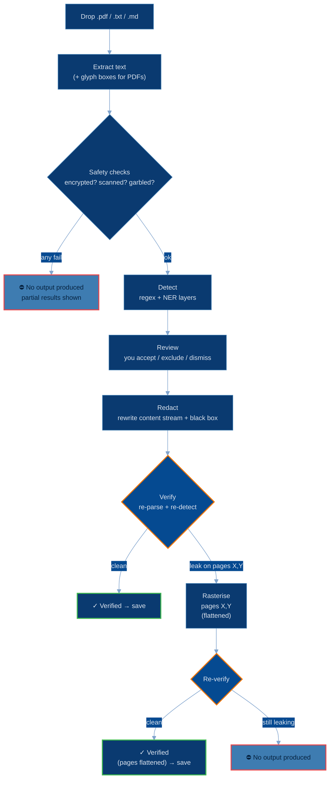
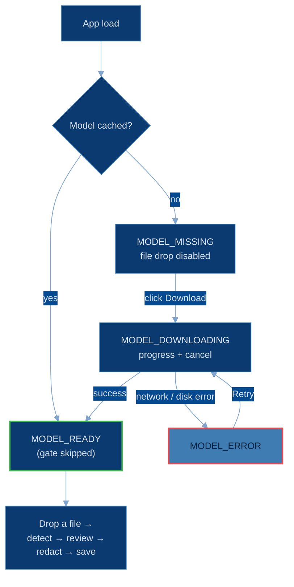
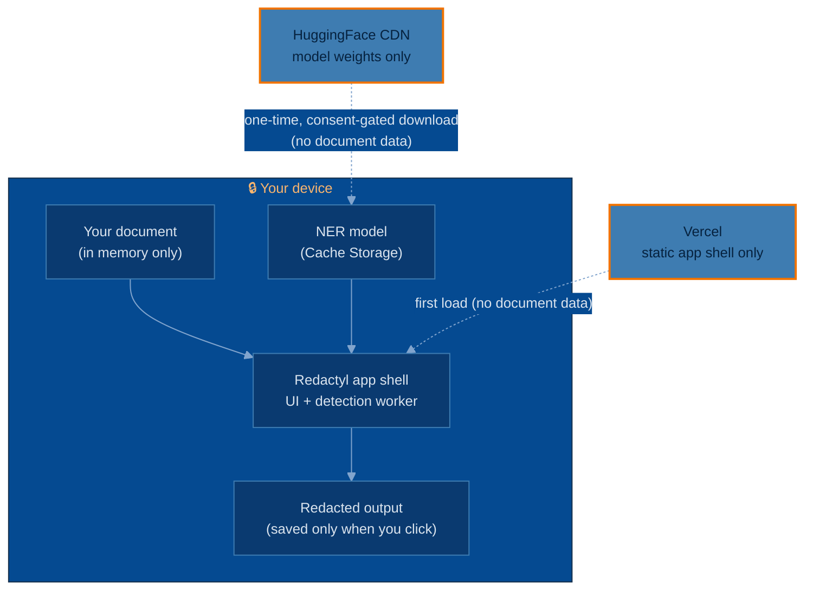

# Redactyl

**Strip PII from PDFs and text, entirely in your browser.**

Redactyl finds personal data in PDFs and text files and produces a sanitised
copy where the data is *truly removed* — not just visually covered. It runs
**100% in your browser**: no backend, your documents are never uploaded, and
after a one-time model download it makes no further network requests while it
works. It's open source, so you can verify that rather than take it on faith.

No detector finds every piece of PII, so treat Redactyl as an aid rather than a
guarantee — it shows you everything it found so you can review and adjust before
sharing the result.

Live at **[redactyl-app.vercel.app](https://redactyl-app.vercel.app/)**. The
domain vocabulary (Item, Occurrence, Span, Category, Bucket, Token, Mapping) is
defined in [`CONTEXT.md`](./CONTEXT.md); hosting rationale in
[ADR 0001](./docs/adr/0001-browser-only-delivery-via-firebase-and-hf-cdn.md).

---

## How it works

Two detection layers feed one review screen:

- a **deterministic regex layer** — emails, phones, URLs, IPs, dates, SSNs,
  Luhn-checked credit cards, mod-97-checked IBANs, and common secret formats
  (AWS/OpenAI/Anthropic/Stripe keys, Bearer tokens, JWTs, PEM blocks);
- an **NER layer** — the `openai/privacy-filter` model via transformers.js,
  catching people, addresses, and account numbers in prose.

Both run in a single **Web Worker**, so the UI stays responsive during model load
and inference. Running in a worker also lets transformers.js resolve the ONNX
runtime WASM **same-origin** (from the app's own bundle, not a CDN) — which is
what makes full offline operation possible. Accepted values become stable
per-category tokens (`<EMAIL_1>`, `<PERSON_2>`) you can reference coherently in an
AI prompt.

### Redaction pipeline



### The verification pass

True redaction is only trustworthy if it's *checked*. After rewriting the PDF,
Redactyl re-opens its own output and re-runs the detectors. The leak test
compares **detected spans, not raw substrings** — so an innocent substring of a
redacted value (`Johnson` containing a redacted `John`) isn't falsely flagged.

- **Clean** → the file is offered with a `✓ Verified` badge.
- **A value survives** the content-stream rewrite (ligatures, CID fonts, kerned
  `TJ` runs, or glyph-less pages) → the affected pages are **rasterised** —
  flattened to an image, dropping the text layer — and verification runs again.
- **Still surviving** → Redactyl produces **no file** and tells you why. It fails
  closed rather than risk handing back a leak.

The same `Detector` runs in the review pass and in verification, so what you
reviewed is what's checked — asserted end-to-end against a
[PDF corpus](./test/fixtures/README.md) ([results](./test/corpus/RESULTS.md)).

### Model gate

The app refuses to detect until the model is cached. The ~770 MB download is
explicit, cancellable, and skipped on return visits.



### Known limitations

- **Browser-printed PDFs are rasterised.** Pages painted through a Form XObject
  (common in "Print to PDF" exports) expose no glyph geometry for the redaction
  box, so they're flattened to images — the text is still removed, it just isn't
  selectable in the output.
  ([why](./test/fixtures/README.md#note--form-xobject-and-the-missing-visual-box))
- **Very old browsers** without cross-origin isolation can't grant
  `SharedArrayBuffer`, which the in-browser model runtime requires; the app
  detects this up front and shows an advisory rather than failing mid-inference.
  Current Chrome, Firefox, and Safari are supported.
- **Scanned and encrypted PDFs are refused, not processed** — v1 doesn't OCR or
  decrypt; both are blocked fail-closed.
- **Detection isn't exhaustive.** Review the output before sharing it.

---

## Privacy & threat model

Redactyl exists so you can paste documents into third-party AI tools (ChatGPT,
Claude, …) **without** sending them the PII inside. It protects your document's
PII against *any party downstream of your clipboard* — and against Redactyl
itself:

- **No upload.** The document is read into browser memory and never sent
  anywhere; there's no server that could receive, log, or retain it.
- **No fake redaction.** Unlike "black rectangle" tools, Redactyl removes the
  text operators from the PDF content stream and verifies the result (above), so
  copy/paste from the output yields nothing.
- **No silent failure.** Every safety check is fail-closed; encrypted, scanned,
  or garbled files are refused with an explicit warning.
- **No telemetry.** No analytics, error reporting, or third-party scripts —
  nothing phones home.

Trust boundaries worth knowing:

- **The model download is the only network call.** On first use the ~770 MB
  `openai/privacy-filter` weights are fetched from the **HuggingFace CDN** behind
  a consent gate — a one-way download of public weights carrying **no document
  data**. After caching, Redactyl works fully offline.
- **The app shell is static, served by Vercel** (HTML/JS/CSS/WASM only); it never
  sees your documents.
- **The mapping file is dangerous by design.** The optional
  `*.redactyl-mapping.json` sidecar can reverse a redaction — anyone with it can
  re-identify. It's off by default; store it carefully.
- **A compromised browser or extension is out of scope** — no in-page tool can
  defend against malware on your machine.

You don't have to trust any of this. Open DevTools → Network, set throttling to
**Offline**, and run a full drop → detect → review → redact → save with the
network physically off — it completes, and no new requests appear. A CI test
([`zeroNetwork.test.ts`](./src/offline/zeroNetwork.test.ts)) enforces it by
trapping `fetch`, `WebSocket`, `XMLHttpRequest`, `EventSource`, and `sendBeacon`
and failing the build if a redaction run touches any of them. (Cross-origin
isolation — DevTools → Application → *Cross-Origin Isolated: yes* — is set in
[`vercel.json`](./vercel.json) and [`vite.config.ts`](./vite.config.ts).)



---

## What's stored where

Redactyl persists as little as possible, and nothing sensitive by default.

| What | Where | When | Leaves your device? |
|---|---|---|---|
| **Your document** | Browser memory (RAM) only | While you're working on it | **Never.** Not written to disk, not uploaded. Gone when you close the tab. |
| **NER model weights (~770 MB)** | Cache Storage (`transformers-cache`) | After you click *Download* | Downloaded *from* HuggingFace once; never uploaded. |
| **App shell + worker + ONNX WASM** | Service-worker precache (Cache Storage) | On first visit | Downloaded *from* Vercel once; enables offline use. |
| **Redacted output / mapping file** | Your local disk | Only when you click *Save* | Only where *you* save it. Nothing auto-downloads. |
| **Theme + detection preferences** | `localStorage` (`redactyl-theme`, …) | When you change them | Never. Plain UI state, no PII. |

Clearing the model cache (⚙ → **Clear cache**) wipes `transformers-cache` and
returns you to the download gate. Clearing site data removes everything above.

---

## Develop

```sh
pnpm install
pnpm build      # type-check + production build (also emits the service worker)
pnpm preview    # serve the build with the cross-origin-isolation headers
pnpm test       # full suite incl. the offline + PDF-corpus regression checks
```

> `pnpm dev` is **not** supported — Vite's dep pre-bundling breaks the
> transformers.js runtime import and hangs the model load. Use
> `pnpm build && pnpm preview`.

Stack: Vite · React · TypeScript · transformers.js (ONNX) · pdfjs · pdf-lib ·
vite-plugin-pwa. Hosted on Vercel; the earlier Firebase Hosting setup and the
cross-origin-isolation rationale are explained in
[ADR 0001](./docs/adr/0001-browser-only-delivery-via-firebase-and-hf-cdn.md).

## Contributing

Issues and PRs welcome. Because the whole point is a verifiable fail-closed
guarantee, changes touching detection, the redaction pipeline, or the
verification pass should come with tests — `pnpm test` runs the offline and
PDF-corpus regression checks that protect it.

## Security

Found a way to defeat the redaction or leak a document? Report it privately — see
[SECURITY.md](./SECURITY.md). Don't open a public issue for vulnerabilities.

## License

[MIT](./LICENSE) © James Garner.
